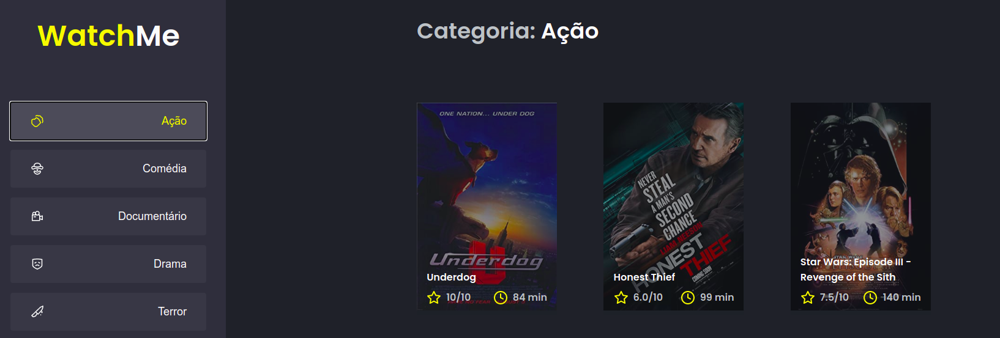

<a id="topo"></a>



<p align="center">
  <a href="https://github.com/RicardoOliveiraFilho">
    
  </a>
  
<p>

Projeto simples construído com ReactJS onde se é consumida uma Fake-API construída através do Json-Server.
Selecionando-se um Gênero de Filmes no menu lateral, a aplicação lista filmes relacionados ao gênero selecionado.

<p align="center">
  <a href="#features">Features</a> •
  <a href="#pre-requisitos">Pré-requisitos</a> •
  <a href="#rodando">Rodando a Aplicação</a> •
  <a href="#tecnologias">Tecnologias</a> •
  <a href="#autor">Autor</a>
</p>

### Features<a id="features"></a> - <a href="#topo">Topo</a>
- [x] Listar filmes com base na escolha do gênero.

<h4  align="left">
Projeto finalizado ✔
</h4>

###  Pré-requisitos<a id="pre-requisitos"></a> - <a href="#topo">Topo</a>

Antes de começar, você vai precisar ter instalado em sua máquina as seguintes ferramentas:
 [Git](https://git-scm.com/),
 e [Node.js](https://nodejs.org/pt-br/) 
 
Além disto é bom ter um editor para trabalhar com o código como [VSCode](https://code.visualstudio.com/)
 
### Rodando a Aplicação<a id="rodando"></a> - <a href="#topo">Topo</a>
   
````bash 
 # Clone este repositório
 git clone https://github.com/RicardoOliveiraFilho/watch-me.git 
 # Acesse a pasta do projeto no terminal, a partir do diretório ao qual o comando de clonagem foi executado
 cd watch-me
 
 # Instale as dependências
 $ yarn ou
 $ npm i 
 
 # Execute a aplicação em modo de desenvolvimento
 $ npm run dev ou 
 $ yarn dev
 
 # Execute a servidor da Fake-API
 $ npm run server ou 
 $ yarn server
 
 # O servidor da aplicação iniciará na porta:8080
 # Acesse http://localhost:8080
 
 # O servidor da Fake-API iniciará na porta:3333
 # Acesse http://localhost:3333/genres ou http://localhost:3333/movies
 ````

### Tecnologias<a id="tecnologias"></a> - <a href="#topo">Topo</a>
As seguintes ferramentas foram usadas na construção do projeto:
 
  - [Sass](https://sass-lang.com/)
  - [Node.js](https://nodejs.org/pt-br/)
  - [React](https://reactjs.org/)
  - [TypeScript](https://www.typescriptlang.org/)
  - [Json-Server](https://github.com/typicode/json-server)

### Autor <a id="autor"> </a> - <a href="#topo">Topo</a>

<a href="https://github.com/RicardoOliveiraFilho" style="text-decoration: none;">

<span> Feito por Ricardo Oliveira - Entre em contato! </span> 
</a>
